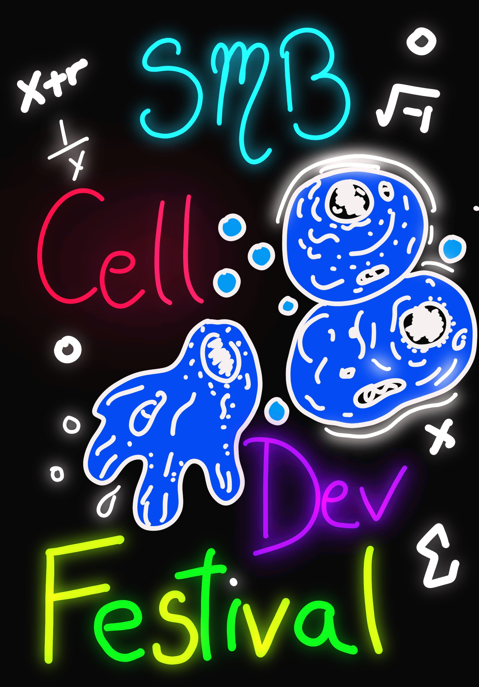

## Virtual Cell and Development Festival Week

The SMB Cell and Developmental Biology (CDEV) Subgroup is hosting a week of virtual minisymposia highlighting research in our community and professional development resources in March 2024. We plan for this event to feature about 2 hours of programming each day for a series of 4 days, combining 1 hour of minisymposia talks, 30 minutes for a professional-development plenary (i.e., with potential topics including careers in industry, mentoring CDEV undergraduate research, and more), and 30 minutes for a social or community discussion.

**Thank you to everyone who has submitted abstracts! At this point, we have a few remaining places available for talks and virtual posters. If you are interested in presenting your work (through a ~15 min virtual talk or a ~5 min poster presentation), please submit your abstract here [here](https://forms.gle/TMDHqLGHhQKXrWpSA) and email us at smbcelldevbio@gmail.com.** Times have been selected to capture a wide range of timezones. We hope you participate!

<!---->

